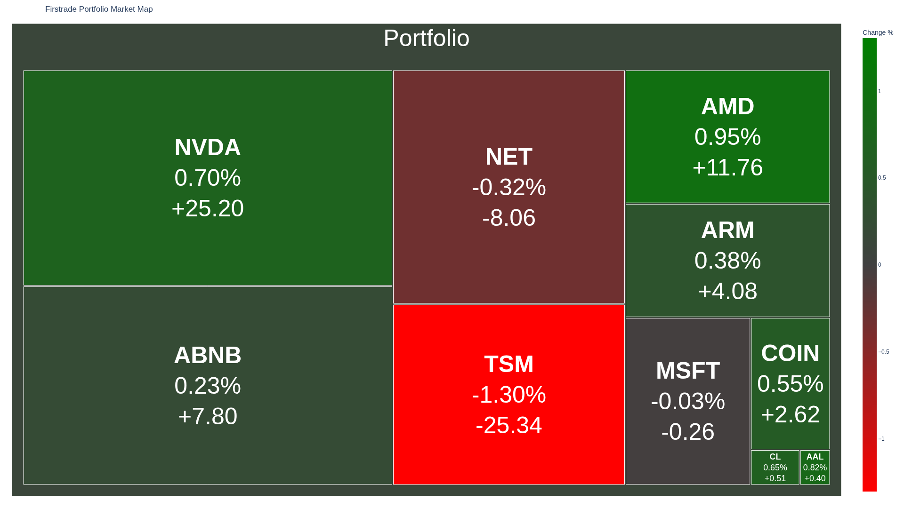

# Firstrade Portfolio Market Map

A Python tool that visualizes your Firstrade investment portfolio as a Market Map (Treemap). It fetches your positions, sizes them by market value, and colors them based on daily percentage change.

## Features

- **Automated Authentication**: securely logs in to Firstrade (supports 2FA).
- **Portfolio Visualization**: Generates an interactive Treemap (`market_map.html`).
- **Image Export**: Saves a high-quality PNG of the map (`market_map.png`).
- **Key Metrics**: Displays Symbol, Daily Change %, and Day Change ($).
- **Visual Cues**:
    - **Size**: Proportional to Market Value (Equity).
    - **Color**: Green for positive change, Red for negative change.

> [!NOTE]
> This tool uses the unofficial [firstrade-api](https://github.com/MaxxRK/firstrade-api) library to connect to Firstrade and fetch portfolio data.

## Prerequisites

- Python 3.8+
- A Firstrade account

## Installation

1.  **Clone the repository** (or navigate to the project directory).

2.  **Install Dependencies**:
    ```bash
    pip install -r requirements.txt
    ```
    *Note: If you are using `uv`, you can run `uv pip install -r requirements.txt`.*

3.  **Configure Credentials**:
    - Rename `.env.example` to `.env`:
      ```bash
      mv .env.example .env
      ```
    - Open `.env` and enter your Firstrade credentials:
      ```env
      FT_USERNAME=your_username
      FT_PASSWORD=your_password
      FT_EMAIL=your_email
      ```

## Usage

Run the main script:

```bash
python main.py
```

If 2FA is enabled on your account, you will be prompted to enter the verification code sent to your email or phone.

## Output

The script generates two files:
1.  `market_map.html`: An interactive HTML file (opens in browser).
2.  `market_map.png`: A static image file (1920x1080).



## Troubleshooting

- **Login Failed**: Verify your credentials in the `.env` file.
- **Image Export Failed**: Ensure `kaleido` is installed (`pip install kaleido`).
- **Empty Map**: Ensure your account has active positions.

## Credits

This repository was created by **Antigravity**, an AI coding assistant by Google DeepMind.
